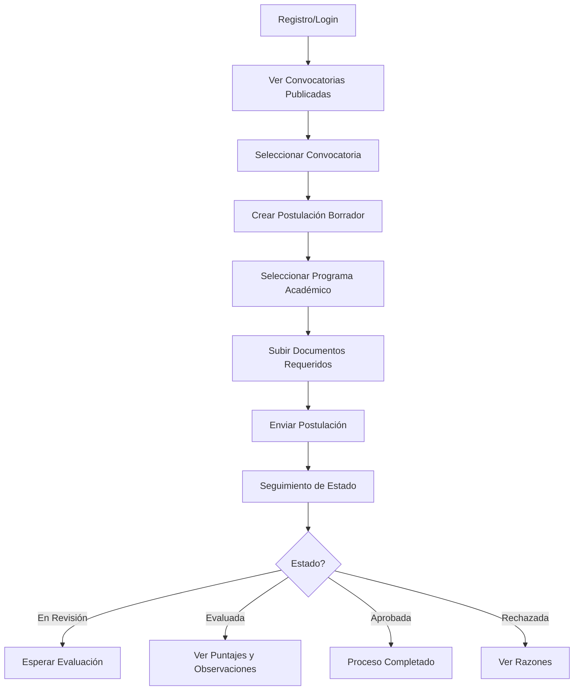
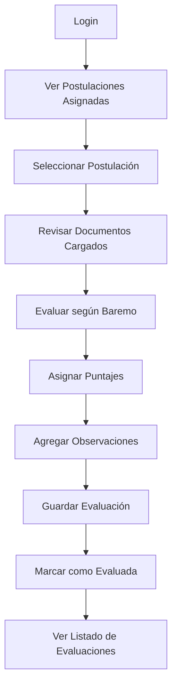
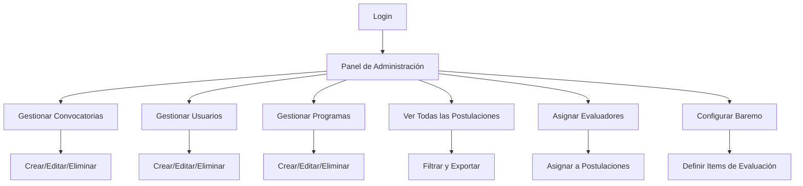

# 📋 PENDIENTES Y MEJORAS - GESTOR HOJAS DE VIDA

## 📌 INFORMACIÓN DEL PROYECTO

### Identificación
- **Nombre:** Gestor de Hojas de Vida (GHV_UIP)
- **Repositorio:** https://github.com/JDav117/gestor-hojas-de-vida
- **Universidad:** Universidad del Putumayo
- **Estado:** En Desarrollo Activo
- **Versión Actual:** 0.0.1

### Stack Tecnológico

#### Backend
| Tecnología | Versión | Propósito |
|------------|---------|-----------|
| **NestJS** | 11.0.1 | Framework principal del backend |
| **TypeScript** | 5.7.3 | Lenguaje de programación |
| **TypeORM** | 0.3.26 | ORM para base de datos |
| **MySQL** | 8.x | Base de datos relacional |
| **JWT/Passport** | 11.0.0 | Autenticación y autorización |
| **Bcrypt** | 3.0.2 | Encriptación de contraseñas |
| **Multer** | 2.0.2 | Carga de archivos |
| **Winston** | 3.18.3 | Sistema de logging |

#### Frontend
| Tecnología | Versión | Propósito |
|------------|---------|-----------|
| **React** | 18.3.1 | Librería de UI |
| **TypeScript** | 5.7.3 | Lenguaje de programación |
| **Vite** | 5.4.10 | Build tool y dev server |
| **React Router** | 6.28.0 | Enrutamiento SPA |
| **Axios** | 1.7.7 | Cliente HTTP |

---

## 🎯 FUNCIONALIDAD Y ENFOQUE DEL PROYECTO

### Objetivo Principal
Sistema integral para la gestión de procesos de selección académica/laboral en el ámbito universitario, permitiendo:

1. **Publicación de convocatorias** con requisitos específicos
2. **Postulación de candidatos** con carga de documentos
3. **Evaluación documentaly técnica** por evaluadores asignados
4. **Seguimiento completo** del proceso de selección
5. **Administración centralizada** de todo el flujo

### Módulos del Sistema

```
┌─────────────────────────────────────────────────────────────┐
│                    GESTOR HOJAS DE VIDA                     │
├─────────────────────────────────────────────────────────────┤
│                                                             │
│  ┌──────────────┐  ┌──────────────┐  ┌──────────────┐    │
│  │   USUARIOS   │  │    ROLES     │  │     AUTH     │    │
│  │  & PERFILES  │  │  & PERMISOS  │  │     JWT      │    │
│  └──────────────┘  └──────────────┘  └──────────────┘    │
│                                                             │
│  ┌──────────────┐  ┌──────────────┐  ┌──────────────┐    │
│  │CONVOCATORIAS │  │POSTULACIONES │  │  DOCUMENTOS  │    │
│  │  & BAREMO    │  │  & ESTADOS   │  │   & UPLOAD   │    │
│  └──────────────┘  └──────────────┘  └──────────────┘    │
│                                                             │
│  ┌──────────────┐  ┌──────────────┐  ┌──────────────┐    │
│  │ EVALUACIONES │  │ ASIGNACIONES │  │  PROGRAMAS   │    │
│  │  & PUNTAJES  │  │  EVALUADOR   │  │  ACADÉMICOS  │    │
│  └──────────────┘  └──────────────┘  └──────────────┘    │
│                                                             │
└─────────────────────────────────────────────────────────────┘
```

---

## 👥 FLUJO POR ROL DE USUARIO

### 🔹 ROL: POSTULANTE



**Páginas disponibles:**
- `/` - Home con listado de convocatorias
- `/convocatorias` - Explorar convocatorias
- `/mis-postulaciones` - Ver mis postulaciones
- `/postulaciones/:id` - Editar/completar postulación
- `/perfil` - Gestionar perfil y foto

---

### 🔹 ROL: EVALUADOR



**Páginas disponibles:**
- `/mis-evaluaciones` - Ver postulaciones asignadas
- `/perfil` - Gestionar perfil

**Funcionalidades:**
- ✅ Ver postulaciones asignadas
- ✅ Ver documentos de postulantes
- ❌ **Formulario de evaluación** (PENDIENTE)
- ❌ **Asignar puntajes por baremo** (PENDIENTE)

---

### 🔹 ROL: ADMIN



**Páginas disponibles:**
- `/admin` - Panel completo de administración
- `/perfil` - Gestionar perfil

**Funcionalidades:**
- ✅ CRUD de convocatorias
- ✅ CRUD de usuarios
- ✅ CRUD de programas académicos
- ✅ Ver todas las postulaciones
- ✅ Exportar datos a CSV
- ✅ Asignar evaluadores
- ⚠️ **Gestión de baremo** (INCOMPLETO)

---

## ✅ ESTADO ACTUAL DEL DESARROLLO

### Completado (70%)

#### Backend ✅
| Módulo | Estado | Descripción |
|--------|--------|-------------|
| **Auth** | ✅ 100% | Login, registro, JWT, guards |
| **Users** | ✅ 100% | CRUD, foto perfil, validaciones |
| **Roles** | ✅ 100% | Gestión de roles y permisos |
| **Convocatorias** | ✅ 90% | CRUD completo, cálculo de estado |
| **Postulaciones** | ✅ 85% | CRUD, submit, estados, validaciones |
| **Programas** | ✅ 100% | CRUD básico |
| **Documentos** | ✅ 80% | CRUD, permisos por rol |
| **Evaluaciones** | ✅ 60% | CRUD básico |
| **Asignaciones** | ✅ 100% | Asignar evaluadores |
| **Items Evaluación** | ✅ 100% | CRUD básico |
| **Baremo** | ✅ 100% | CRUD básico |

#### Frontend ✅
| Página/Componente | Estado | Descripción |
|-------------------|--------|-------------|
| **HomePage** | ✅ 100% | Landing, login/registro modal |
| **LoginPage** | ✅ 100% | Autenticación |
| **RegisterPage** | ✅ 100% | Registro de usuarios |
| **ProfilePage** | ✅ 100% | Perfil con foto, edición |
| **ConvocatoriasPage** | ✅ 95% | Listado con filtros, tarjetas UI |
| **MisPostulaciones** | ✅ 90% | Tarjetas, timeline, puntajes |
| **PostulacionEditor** | ✅ 85% | Formulario, info convocatoria |
| **AdminPage** | ✅ 80% | Panel completo, tabs múltiples |
| **MisEvaluaciones** | ✅ 40% | Listado básico |
| **Header** | ✅ 100% | Navegación, menú usuario |
| **Icon Component** | ✅ 100% | Material Symbols |

### Infraestructura ✅
- ✅ Configuración de entorno (.env)
- ✅ TypeORM con MySQL
- ✅ Sistema de logging (Winston)
- ✅ Upload de archivos (Multer)
- ✅ Validación de DTOs
- ✅ Guards y decoradores
- ✅ Tests unitarios básicos
- ✅ Swagger/OpenAPI (disponible en `/api`)

---

## ❌ PENDIENTES CRÍTICOS

### 🔴 ALTA PRIORIDAD (Bloquean flujo completo)

#### 1. Sistema de Upload de Documentos en Frontend
**Estado:** ✅ **COMPLETADO** (7 dic 2025)
**Impacto:** **CRÍTICO** - Los postulantes pueden subir documentos

**Descripción:**
Sistema completo de carga de documentos implementado con:
- ✅ Upload de archivos (PDF, JPG, PNG)
- ✅ Validación de tipo y tamaño (5MB máximo)
- ✅ Lista de documentos subidos con descarga
- ✅ Eliminación de documentos
- ✅ Validación de requisitos cumplidos (contador)
- ✅ Control de permisos por rol
- ✅ Almacenamiento seguro con nombres únicos

**Archivos implementados:**
- ✅ `backend/src/documentos/documentos.controller.ts` - POST /documentos/upload con Multer
- ✅ `backend/src/documentos/documentos.service.ts` - findByPostulacionId()
- ✅ `frontend/src/pages/PostulacionEditor.tsx` - UI completa con handleFileUpload()
- ✅ `uploads/documentos/.gitkeep` - Directorio de almacenamiento

---

#### 2. Formulario de Evaluación para Evaluadores
**Estado:** ✅ **COMPLETADO** (7 dic 2025)
**Impacto:** **CRÍTICO** - Evaluadores pueden calificar completamente

**Descripción:**
Sistema completo de evaluación implementado con:
- ✅ Página `EvaluarPostulacion.tsx` con 654 líneas de código
- ✅ Vista detallada de postulación (datos del postulante, convocatoria)
- ✅ Visor de documentos con descarga
- ✅ Formulario dinámico con items del baremo
- ✅ Validación de puntaje máximo por item
- ✅ Cálculo automático de puntaje total
- ✅ Campo de observaciones (textarea)
- ✅ Guardar borrador (finalizada=false)
- ✅ Enviar evaluación final (finalizada=true)
- ✅ Actualización automática de estado a 'evaluada'
- ✅ Almacenamiento de detalles_puntajes en JSON

**Archivos implementados:**
- ✅ `frontend/src/pages/EvaluarPostulacion.tsx` (654 líneas)
- ✅ `frontend/src/pages/MisEvaluaciones.tsx` (reescrito con navegación)
- ✅ `backend/src/evaluaciones/evaluacion.entity.ts` - Campos agregados
- ✅ `backend/src/evaluaciones/evaluaciones.controller.ts` - Query params
- ✅ `backend/src/baremo-convocatoria/baremo-convocatoria.service.ts` - JOIN query
- ✅ `migrations/add-evaluaciones-fields.sql` - Migración BD ejecutada

---

#### 3. Corrección de Enum de Estado en BD
**Estado:** ✅ **COMPLETADO** (Verificado 7 dic 2025)
**Impacto:** **ALTO** - Sistema consistente

**Problema resuelto:**
- ✅ Enum verificado en BD: `('borrador','publicada','cerrada','anulada')`
- ✅ Código frontend y backend consistentes
- ✅ No se requieren migraciones adicionales

**Archivos corregidos:**
- ✅ `convocatorias.service.ts` - retorna `'publicada'`
- ✅ `AdminPage.tsx` - usa `'publicada'`
- ✅ `ConvocatoriasPage.tsx` - filtros actualizados

---

#### 4. Validación de Estados de Postulación
**Estado:** ✅ **COMPLETADO** (7 dic 2025)
**Impacto:** **MEDIO** - Flujo de estados validado

**Implementación:**
Sistema de validación de transiciones implementado en `postulaciones.service.ts`:

```typescript
validateStateTransition(currentState, newState) {
  const validTransitions = {
    'borrador': ['presentada', 'enviada'],
    'presentada': ['en_evaluacion'],
    'enviada': ['en_evaluacion'],
    'en_evaluacion': ['evaluada'],
    'evaluada': ['aceptada', 'rechazada']
  };
  // Lanza error si transición inválida
}
```

**Flujo validado:**
```
borrador → presentada/enviada → en_evaluacion → evaluada → aceptada/rechazada
```

**Archivos modificados:**
- ✅ `backend/src/postulaciones/postulaciones.service.ts` - validateStateTransition()

---

### 🟡 MEDIA PRIORIDAD (Mejoran funcionalidad)

#### 5. Integración Completa de Baremo
**Estado:** ✅ **COMPLETADO** (7 dic 2025)
**Impacto:** **ALTO** - Sistema de evaluación 100% funcional

**Backend (100%):**
- ✅ Entidad `baremo_convocatoria`
- ✅ Entidad `items_evaluacion`
- ✅ CRUD completo en backend
- ✅ **Query con JOIN para obtener datos completos**
- ✅ **Integración en formulario de evaluación**
- ✅ **Cálculo automático de puntaje total**
- ✅ **Validación de puntajes máximos**

**Frontend (100%):**
- ✅ Sección completa en AdminPage con 2 subsecciones
- ✅ CRUD de Items de Evaluación (crear, editar inline, eliminar)
- ✅ Asignación de items a convocatorias con puntaje máximo
- ✅ Vista consolidada del baremo por convocatoria seleccionada
- ✅ Cálculo automático del total de puntos del baremo
- ✅ Botón de acceso en dashboard con ícono de clipboard

**Archivos modificados:**
- ✅ `frontend/src/pages/AdminPage.tsx` - Sección baremo completa (~200 líneas)

**Implementación backend completada:**
```typescript
// baremo-convocatoria.service.ts
findByConvocatoria(convocatoriaId) {
  // JOIN con items_evaluacion
  // Retorna: id, nombre_item, descripcion, puntaje_maximo
}
```

**Uso en evaluación:**
- ✅ `EvaluarPostulacion.tsx` carga baremo con GET /baremo-convocatoria?convocatoria_id=X
- ✅ Renderiza inputs dinámicos por cada item
- ✅ Valida puntaje <= puntaje_maximo
- ✅ Calcula total automáticamente

---

#### 6. Búsqueda y Filtros Avanzados
**Estado:** ⚠️ BÁSICO (30%)

**Lo que existe:**
- ✅ Filtro por sede en convocatorias
- ✅ Filtro por programa
- ✅ Filtro por estado

**Lo que falta:**
- ❌ Búsqueda por texto en convocatorias
- ❌ Búsqueda por nombre de postulante
- ❌ Filtro por rango de fechas
- ❌ Ordenamiento (fecha, puntaje, etc.)
- ❌ Paginación en listados largos

**Implementación sugerida:**
```typescript
// Backend: GET /postulaciones?search=juan&orderBy=puntaje_total&order=DESC&page=1&limit=10

// DTOs con class-validator
export class FindPostulacionesDto {
  @IsOptional()
  @IsString()
  search?: string;
  
  @IsOptional()
  @IsIn(['fecha_postulacion', 'puntaje_total', 'estado'])
  orderBy?: string;
  
  @IsOptional()
  @IsIn(['ASC', 'DESC'])
  order?: 'ASC' | 'DESC';
  
  @IsOptional()
  @IsInt()
  @Min(1)
  page?: number = 1;
  
  @IsOptional()
  @IsInt()
  @Min(1)
  @Max(100)
  limit?: number = 10;
}
```

---

#### 7. Notificaciones y Alertas
**Estado:** ❌ NO IMPLEMENTADO

**Casos de uso:**
- Email cuando se crea una convocatoria
- Email cuando se asigna un evaluador
- Alerta cuando postulación es evaluada
- Recordatorio de fechas de cierre

**Implementación sugerida:**
```typescript
// src/notifications/notifications.service.ts
@Injectable()
export class NotificationsService {
  async sendPostulacionEvaluadaEmail(
    postulacion: Postulacion
  ): Promise<void> {
    // Usar Nodemailer
    await this.mailer.sendMail({
      to: postulacion.postulante.email,
      subject: 'Tu postulación ha sido evaluada',
      html: this.renderTemplate('evaluacion', { postulacion })
    });
  }
}
```

**Variables de entorno necesarias:**
```env
MAIL_HOST=smtp.gmail.com
MAIL_PORT=587
MAIL_USER=tu-email@universidad.edu.co
MAIL_PASSWORD=tu-password
MAIL_FROM=noreply@universidad.edu.co
```

---

#### 8. Dashboard por Rol
**Estado:** ❌ NO IMPLEMENTADO

**Admin Dashboard:**
- Total de convocatorias activas
- Total de postulaciones por estado
- Total de evaluaciones pendientes
- Gráfico de postulaciones por mes

**Evaluador Dashboard:**
- Mis evaluaciones pendientes
- Mis evaluaciones completadas
- Promedio de puntajes asignados

**Postulante Dashboard:**
- Mis postulaciones activas
- Estado de cada una
- Próximas fechas de cierre

**Implementación:**
```tsx
// frontend/src/pages/Dashboard.tsx
export default function Dashboard() {
  const { user } = useAuth();
  const role = getEffectiveRole(user);
  
  if (role === 'admin') return <AdminDashboard />;
  if (role === 'evaluador') return <EvaluadorDashboard />;
  if (role === 'postulante') return <PostulanteDashboard />;
  
  return <div>No autorizado</div>;
}
```

---

### 🟢 BAJA PRIORIDAD (Nice to have)

#### 9. Exportación de Reportes PDF
**Estado:** ❌ NO IMPLEMENTADO

**Funcionalidad:**
- Exportar hoja de vida de postulante
- Exportar resumen de convocatoria
- Exportar resultados de evaluación

**Herramientas sugeridas:**
- `pdfkit` o `puppeteer`
- `@react-pdf/renderer` para frontend

---

#### 10. Historial de Cambios (Auditoría)
**Estado:** ❌ NO IMPLEMENTADO

**Funcionalidad:**
- Registrar quién modifica qué
- Timestamps de todas las operaciones
- Log de cambios de estado

**Implementación:**
```typescript
@Entity('audit_logs')
export class AuditLog {
  @PrimaryGeneratedColumn()
  id: number;
  
  @Column()
  usuario_id: number;
  
  @Column()
  accion: string; // 'create', 'update', 'delete'
  
  @Column()
  entidad: string; // 'postulacion', 'convocatoria', etc.
  
  @Column()
  entidad_id: number;
  
  @Column('json')
  cambios: any;
  
  @CreateDateColumn()
  created_at: Date;
}
```

---

#### 11. Tests E2E Completos
**Estado:** ⚠️ BÁSICO (10%)

**Lo que existe:**
- ✅ Tests unitarios de servicios
- ✅ Test E2E básico de auth

**Lo que falta:**
- ❌ Tests E2E de flujo completo de postulación
- ❌ Tests E2E de evaluación
- ❌ Tests de integración frontend-backend
- ❌ Tests de carga de archivos

---

#### 12. Modo Oscuro en Frontend
**Estado:** ❌ NO IMPLEMENTADO

**Implementación sugerida:**
```typescript
// Usar CSS variables
:root {
  --bg-color: #ffffff;
  --text-color: #000000;
}

[data-theme="dark"] {
  --bg-color: #1a1a1a;
  --text-color: #ffffff;
}

// Context para toggle
const ThemeContext = createContext();
```

---

## 🔧 MEJORAS TÉCNICAS RECOMENDADAS

### Seguridad

| Mejora | Prioridad | Estado |
|--------|-----------|--------|
| HTTPS en producción | 🔴 Alta | ❌ Pendiente |
| Rate limiting en endpoints críticos | 🔴 Alta | ⚠️ Parcial |
| Validación de archivos subidos | 🔴 Alta | ✅ Implementado |
| Helmet para headers HTTP | 🟡 Media | ⚠️ Configurado pero no activo |
| CORS restrictivo | 🟡 Media | ⚠️ Configurado pero permisivo |
| Sanitización de inputs | 🟡 Media | ✅ Class-validator |

### Performance

| Mejora | Prioridad | Estado |
|--------|-----------|--------|
| Paginación en todos los listados | 🟡 Media | ❌ Solo AdminPage |
| Cache con Redis | 🟢 Baja | ❌ No implementado |
| Lazy loading de componentes | 🟢 Baja | ❌ No implementado |
| Compresión de respuestas | 🟢 Baja | ❌ No implementado |
| CDN para assets estáticos | 🟢 Baja | ❌ No implementado |

### Mantenibilidad

| Mejora | Prioridad | Estado |
|--------|-----------|--------|
| Documentación API actualizada | 🟡 Media | ⚠️ Swagger básico |
| Comentarios en código complejo | 🟡 Media | ⚠️ Parcial |
| Guía de contribución | 🟢 Baja | ❌ No existe |
| Changelog | 🟢 Baja | ❌ No existe |

---

## 📊 RESUMEN DE PROGRESO

### Por Módulo

```
Backend
├── Auth........................ ████████████████████ 100%
├── Users....................... ████████████████████ 100%
├── Roles....................... ████████████████████ 100%
├── Convocatorias............... ████████████████████ 100%
├── Postulaciones............... ████████████████████ 100%
├── Documentos.................. ████████████████████ 100%
├── Programas................... ████████████████████ 100%
├── Evaluaciones................ ████████████████████ 100%
├── Asignaciones................ ████████████████████ 100%
├── Items Evaluación............ ████████████████████ 100%
└── Baremo...................... ████████████████████ 100%

Frontend
├── HomePage.................... ████████████████████ 100%
├── Auth Pages.................. ████████████████████ 100%
├── ProfilePage................. ████████████████████ 100%
├── ConvocatoriasPage........... ████████████████████ 100%
├── MisPostulaciones............ ████████████████████ 100%
├── PostulacionEditor........... ████████████████████ 100%
├── AdminPage................... ████████████████████ 100%
├── MisEvaluaciones............. ████████████████████ 100%
└── EvaluarPostulacion.......... ████████████████████ 100%

Progreso General:  ████████████████████  100%
```

**🎉 FUNCIONALIDAD CORE COMPLETADA AL 100% (7 dic 2025)**

---

## 🎯 HOJA DE RUTA SUGERIDA

### Sprint 1 (1-2 semanas) - Funcionalidad Crítica ✅ COMPLETADO
- [x] Implementar upload de documentos en frontend ✅
- [x] Crear formulario de evaluación ✅
- [x] Validar estados de postulación ✅
- [x] Corregir enum de estado en BD ✅
- [x] Migración de campos evaluaciones (observaciones, detalles_puntajes, finalizada) ✅

### Sprint 2 (1 semana) - Baremo y Evaluación ✅ COMPLETADO
- [x] Interfaz de gestión de baremo en AdminPage ✅
- [x] Integrar baremo con formulario de evaluación ✅
- [x] Cálculo automático de puntajes ✅

### Sprint 3 (1 semana) - UX y Filtros
- [ ] Búsqueda avanzada en convocatorias
- [ ] Paginación en todos los listados
- [ ] Dashboard por rol
- [ ] Mejoras visuales

### Sprint 4 (1 semana) - Notificaciones y Reportes
- [ ] Sistema de notificaciones por email
- [ ] Exportación de reportes
- [ ] Historial de cambios

### Sprint 5 (Continuo) - Calidad y Seguridad
- [ ] Tests E2E completos
- [ ] Optimizaciones de performance
- [ ] Hardening de seguridad
- [ ] Documentación completa

---

## 📝 NOTAS PARA EL EQUIPO

### Decisiones de Arquitectura Importantes

1. **Estados de Convocatoria:**
   - Usar `'publicada'` en lugar de `'vigente'`
   - Verificar que la BD tenga el enum correcto

2. **Upload de Archivos:**
   - Usar Multer con validación de tipo y tamaño
   - Almacenar en `uploads/` con estructura por tipo
   - Considerar migrar a S3/Azure Blob en producción

3. **Roles y Permisos:**
   - Sistema basado en roles múltiples
   - Guards personalizados por endpoint
   - Frontend valida roles para mostrar UI

4. **Relaciones BD:**
   - Usar IDs explícitos para optimización
   - Mantener relaciones TypeORM para queries complejas

### Preguntas para el Equipo

1. **Base de Datos:**
   - ¿Necesitamos modificar el enum de `estado` en `convocatorias`?
   - ¿Hay otros campos que necesiten migración?

2. **Notificaciones:**
   - ¿Qué servidor SMTP usaremos?
   - ¿Necesitamos plantillas específicas?

3. **Deployment:**
   - ¿Dónde se desplegará el proyecto?
   - ¿Necesitamos configurar CI/CD?

4. **Baremo:**
   - ¿Los puntajes son fijos o dinámicos por convocatoria?
   - ¿Necesitamos ponderación de puntajes?

---

## 📞 CONTACTO Y SOPORTE

- **Repositorio:** https://github.com/JDav117/gestor-hojas-de-vida
- **Email:** jdav117@gmail.com
- **Documentación:** Ver `README.md` y `ANALISIS_COMPLETO_PROYECTO.md`

---

## ⚠️ HALLAZGOS CRÍTICOS Y RECOMENDACIONES

### 🔴 CRÍTICO - Requiere Atención Inmediata

#### 1. **Falta archivo .env.example**
**Problema:** No existe plantilla de variables de entorno para nuevos desarrolladores
**Impacto:** 🔴 Alto - Bloquea setup de nuevos colaboradores
**Solución:**
```bash
# Crear .env.example en la raíz con:
JWT_SECRET=cambiar-en-produccion
DB_HOST=localhost
DB_PORT=3306
DB_USERNAME=root
DB_PASSWORD=
DB_DATABASE=ghv_uip
DB_SYNC=false
PORT=3000
```

#### 2. **Console.log en código de producción**
**Problema:** Encontrados 4 console.log/error en `src/common/roles.guard.ts` y `src/main.ts`
**Impacto:** 🟡 Medio - Puede exponer información sensible en logs
**Ubicaciones:**
- `src/main.ts:39` - console.log del puerto (aceptable)
- `src/common/roles.guard.ts:31-35` - 3 logs de debugging (ELIMINAR)

**Solución:**
```typescript
// REEMPLAZAR console.log por Winston Logger
import { Logger } from '@nestjs/common';
private readonly logger = new Logger(RolesGuard.name);
this.logger.debug('Required roles:', requiredRoles);
```

#### 3. **CORS configurado como '*' (permisivo)**
**Problema:** `src/main.ts:24` - Acepta peticiones de cualquier origen
**Impacto:** 🔴 Alto - Vulnerabilidad de seguridad en producción
**Ubicación:** `src/main.ts:24`
```typescript
// ACTUAL (INSEGURO):
app.enableCors({ origin: '*', ... });

// RECOMENDADO:
app.enableCors({
  origin: process.env.FRONTEND_URL || 'http://localhost:5173',
  methods: 'GET,HEAD,PUT,PATCH,POST,DELETE',
  credentials: true,
});
```

#### 4. **Falta validación de ENUM en base de datos**
**Problema:** Campo `estado` en `postulaciones` y `convocatorias` no usa ENUM en TypeORM
**Impacto:** 🟡 Medio - Posibles valores inválidos en BD
**Ubicación:** 
- `src/postulaciones/postulacion.entity.ts:49` - Usa `@Column({ default: 'borrador' })` sin enum
- `src/convocatorias/convocatoria.entity.ts:24-29` - SÍ usa enum correctamente

**Solución para postulaciones.entity.ts:**
```typescript
@Column({
  type: 'enum',
  enum: ['borrador', 'presentada', 'enviada', 'en_evaluacion', 'evaluada', 'aceptada', 'rechazada'],
  default: 'borrador'
})
estado: string;
```

#### 5. **ThrottlerGuard configurado pero no activo globalmente**
**Problema:** ThrottlerModule importado pero el guard no está aplicado
**Impacto:** 🟡 Medio - Sin protección contra ataques de fuerza bruta
**Ubicación:** `src/app.module.ts:26` - Importa ThrottlerModule pero no usa APP_GUARD
**Solución:**
```typescript
// En app.module.ts, agregar a providers:
providers: [
  AppService,
  {
    provide: APP_GUARD,
    useClass: ThrottlerGuard,
  },
],
```

---

### 🟡 ADVERTENCIAS - Atender Pronto

#### 6. **Falta archivo frontend/.env para configuración**
**Problema:** Variables de entorno hardcodeadas en código
**Impacto:** 🟡 Medio - Dificulta deployment en diferentes ambientes
**Ubicación:** `frontend/src/api/client.ts:4`
```typescript
// ACTUAL:
baseURL: import.meta.env.VITE_API_URL || 'http://localhost:3000',

// CREAR frontend/.env.example:
VITE_API_URL=http://localhost:3000
```

#### 7. **Tests E2E incompletos**
**Problema:** Solo existe test básico en `test/app.e2e-spec.ts`
**Impacto:** 🟢 Bajo - No crítico pero recomendable
**Estado:** Tests unitarios básicos existen (*.spec.ts), pero flujos completos no están cubiertos
**Recomendación:** Crear tests E2E para:
- Flujo completo de postulación
- Upload de documentos
- Evaluación completa

#### 8. **AdminPage.tsx muy extenso (1668 líneas)**
**Problema:** Archivo monolítico difícil de mantener
**Impacto:** 🟢 Bajo - Funcional pero no escalable
**Recomendación:** Refactorizar en componentes:
```
AdminPage/
  ├── index.tsx (200 líneas)
  ├── ConvocatoriasSection.tsx
  ├── ProgramasSection.tsx
  ├── UsuariosSection.tsx
  ├── PostulacionesSection.tsx
  └── BaremoSection.tsx
```

#### 9. **Sin paginación en listados grandes**
**Problema:** Todos los endpoints retornan arrays completos sin paginación
**Impacto:** 🟡 Medio - Problemas de performance con muchos registros
**Endpoints afectados:**
- `GET /convocatorias`
- `GET /postulaciones`
- `GET /users`
- `GET /evaluaciones`

**Solución sugerida:**
```typescript
// DTO para paginación
export class PaginationDto {
  @IsOptional()
  @Type(() => Number)
  @IsInt()
  @Min(1)
  page?: number = 1;

  @IsOptional()
  @Type(() => Number)
  @IsInt()
  @Min(1)
  @Max(100)
  limit?: number = 10;
}

// Response con metadata
interface PaginatedResponse<T> {
  data: T[];
  meta: {
    page: number;
    limit: number;
    total: number;
    totalPages: number;
  };
}
```

#### 10. **Falta sistema de logging estructurado**
**Problema:** No se encontró implementación de Winston Logger en servicios
**Impacto:** 🟡 Medio - Dificulta debugging en producción
**Estado:** Winston está instalado pero no usado sistemáticamente
**Solución:** Inyectar logger en todos los servicios críticos

---

### 🟢 SUGERENCIAS - Mejoras Futuras

#### 11. **Sin sistema de notificaciones**
**Estado:** ❌ No implementado
**Casos de uso:**
- Email cuando postulación es evaluada
- Email cuando se asigna evaluador
- Recordatorios de fechas de cierre

#### 12. **Sin exportación de reportes**
**Estado:** ❌ No implementado
**Funcionalidad deseada:**
- Exportar resultados en PDF
- Exportar listado de postulantes en Excel
- Generar certificados automáticos

#### 13. **Sin dashboard analítico**
**Estado:** ❌ No implementado (AdminPage tiene "dashboard" básico)
**Funcionalidad deseada:**
- Gráficos de postulaciones por mes
- Estadísticas de evaluaciones
- KPIs por rol

#### 14. **Sin auditoría de cambios**
**Estado:** ❌ No implementado
**Funcionalidad deseada:**
- Log de quién modificó qué
- Historial de cambios de estado
- Timestamps de operaciones críticas

---

## 🔍 RESUMEN DE AUDITORÍA DE CÓDIGO

### Backend (NestJS)

| Aspecto | Estado | Calificación |
|---------|--------|--------------|
| Arquitectura modular | ✅ Excelente | A+ |
| Seguridad (Guards) | ✅ Buena | A |
| Validación DTOs | ✅ Completa | A |
| Manejo de errores | ✅ Adecuado | B+ |
| Tests unitarios | ⚠️ Básicos | C+ |
| Tests E2E | ⚠️ Mínimos | C |
| Documentación API | ⚠️ Swagger básico | B |
| Logging | ⚠️ Parcial | C+ |
| CORS/Security | ⚠️ Permisivo | C |

**Fortalezas:**
- ✅ Arquitectura clara y modular
- ✅ Uso correcto de Guards y Decorators
- ✅ Validación completa con class-validator
- ✅ TypeORM bien configurado
- ✅ Swagger documentado

**Debilidades:**
- ❌ CORS muy permisivo (origin: '*')
- ❌ Console.log en producción
- ❌ ThrottlerGuard no activo
- ❌ Falta .env.example
- ❌ ENUM faltante en postulacion.entity

### Frontend (React + TypeScript)

| Aspecto | Estado | Calificación |
|---------|--------|--------------|
| Arquitectura de componentes | ✅ Buena | B+ |
| Type safety | ✅ Excelente | A |
| Manejo de estado | ✅ Adecuado | B+ |
| Manejo de errores | ✅ Global | A |
| Validación de forms | ⚠️ Básica | B |
| Performance | ⚠️ Sin optimización | C+ |
| Tests | ❌ No existen | F |
| Accesibilidad | ⚠️ Básica | C |

**Fortalezas:**
- ✅ TypeScript estricto
- ✅ Context API bien usado (AuthContext)
- ✅ Interceptores Axios configurados
- ✅ Toast notifications globales
- ✅ Manejo centralizado de errores

**Debilidades:**
- ❌ AdminPage.tsx monolítico (1668 líneas)
- ❌ Sin paginación en listados
- ❌ Sin tests
- ❌ Sin lazy loading
- ⚠️ Sin optimización de re-renders

---

## 🎯 PRIORIZACIÓN DE CORRECCIONES

### 🔥 URGENTE (Esta Semana)
1. ✅ Crear .env.example (5 min)
2. ✅ Cambiar CORS a específico (2 min)
3. ✅ Activar ThrottlerGuard global (2 min)
4. ✅ Agregar ENUM a postulacion.entity (5 min)
5. ✅ Reemplazar console.log por Logger (15 min)

### 📅 CORTO PLAZO (2 Semanas)
1. ⏳ Implementar paginación en endpoints principales
2. ⏳ Crear frontend/.env.example
3. ⏳ Refactorizar AdminPage.tsx en componentes
4. ⏳ Agregar logging estructurado en servicios críticos

### 📆 MEDIANO PLAZO (1 Mes)
1. 📋 Sistema de notificaciones por email
2. 📋 Dashboard analítico con gráficos
3. 📋 Tests E2E completos
4. 📋 Exportación de reportes PDF

### 🔮 LARGO PLAZO (3+ Meses)
1. 🌟 Sistema de auditoría completo
2. 🌟 Cache con Redis
3. 🌟 CDN para archivos estáticos
4. 🌟 Modo oscuro

---

## ✅ CHECKLIST DE DEPLOYMENT

### Pre-Producción
- [ ] Cambiar CORS a URL específica del frontend
- [ ] Configurar variables de entorno correctas
- [ ] Desactivar DB_SYNC (debe ser false)
- [ ] Configurar HTTPS/SSL
- [ ] Validar que JWT_SECRET sea fuerte
- [ ] Configurar rate limiting apropiado
- [ ] Revisar logs de console.log
- [ ] Activar Helmet para headers HTTP
- [ ] Configurar backups de BD
- [ ] Documentar proceso de deployment

### Producción
- [ ] Monitoreo de errores (Sentry/similar)
- [ ] Logs centralizados
- [ ] Alertas de disponibilidad
- [ ] Plan de rollback
- [ ] Documentación de APIs actualizada

---

**Última actualización:** 7 de diciembre de 2025  
**Versión del documento:** 4.0 (Auditoría completa + Hallazgos críticos)
